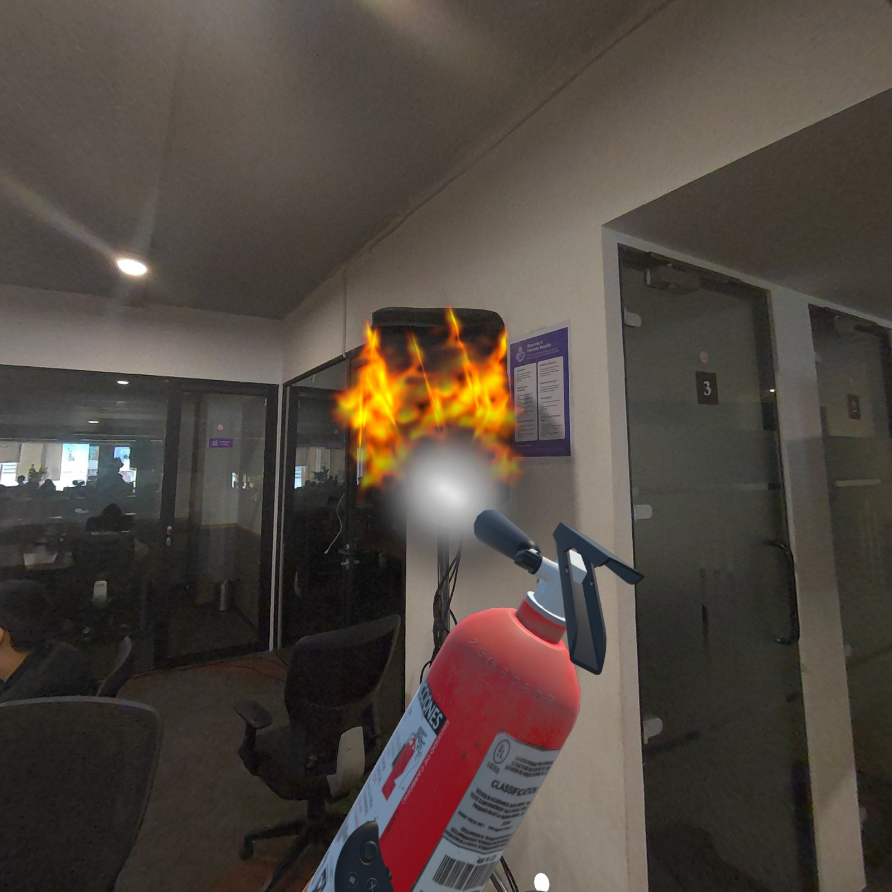
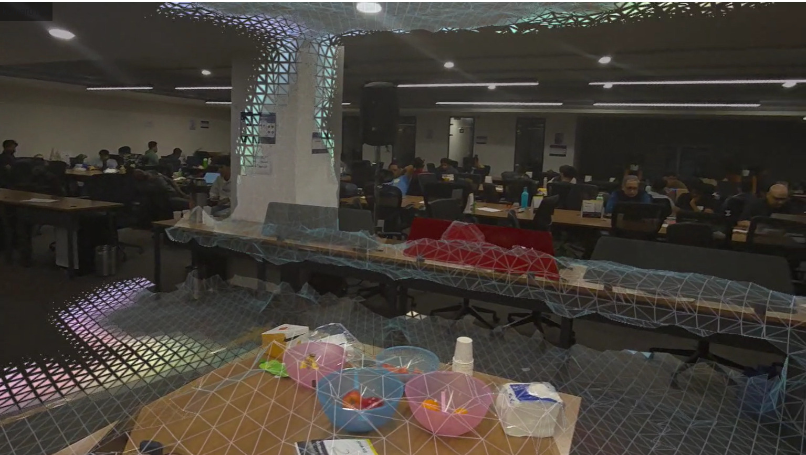

# AgniXR — Mixed Reality Fire Drill Simulator

> A flight simulator, but for fire safety — and it works in **any building**.

AgniXR is a Mixed Reality fire-drill training app for the **Meta Quest 3**. It
turns a user's *real* room — scanned live through passthrough — into the stage
for a realistic, timed, scored fire drill. No pre-built virtual level required.

<p align="center">
  
  
</p>

---

## The problem

Fire drills are legally mandated almost everywhere — offices, factories,
hospitals, schools — yet they're broken:

- **Scheduled**, so there's no surprise and no realism.
- **Boring**, so nobody takes them seriously.
- **Produce zero data** — no manager can say who knew where the extinguisher was,
  who froze, or how long evacuation actually took.

AgniXR makes drills **realistic, repeatable, and measurable**. The game is the
hook; the readiness data is the product. It reframes a forced compliance expense
into an actual risk-management tool.

---

## What it does

Put on the headset and you see your own workspace — now with smoke, an alarm,
and spreading fire. Find the right extinguisher, put out the fire, and get to the
exit. Every second is timed and scored.

The app is **architecture-agnostic**: it never relies on a hardcoded 3D level. It
scans the real environment and places every hazard relative to that scan, so the
same drill logic works out-of-the-box in any room.

### Two modes, one scanned room

| Mode | Who | What it does |
|------|-----|--------------|
| **Create** | Safety officer / author | Drag-and-place fires, extinguishers, alarms, and an exit into the scanned room (*"as easy as Figma"*). Saves the layout as a scenario JSON. |
| **Run** | Trainee | Loads the scenario, restores every item at its exact authored position, times the run, and scores the player's actions. |

Reaching the exit fires a single API call with the run result, which a decoupled
dashboard turns into compliance & readiness reporting.

---

## How it works

### The spawnable item system
Every authorable object — fire, extinguisher, alarm, exit — is the **same prefab**,
parameterized by a type enum. One code path, not one per item.

```
SpawnableItemType: Alarm | ExtinguisherA | ExtinguisherB | FireA | FireB | Endpoint
```

A scored matching mechanic enforces correct response: a **Class A** extinguisher
puts out a **Class A** fire, **B** puts out **B**; mismatches are detectable.

### Scenario persistence (the core technical bet)
Create mode serializes each placed item's **type + pose** to JSON, stored
*relative to the scanned-room anchor* — not a world position. Run mode rehydrates
that JSON and restores each item to the identical physical spot in any scanned
room. This positional fidelity across Create → Run is what makes the app
architecture-agnostic.

### End-of-run reporting
The headset only ever **POSTs at end of run** — it never reads from the backend,
so the simulation never blocks on the dashboard. One event (reaching the exit)
fires one API call carrying the score, time, and action breakdown.

---

## Technology stack

| Layer | Tools |
|-------|-------|
| **Headset / Runtime** | Meta Quest 3 (passthrough mixed reality) |
| **Engine** | Unity (C#) |
| **MR & interaction** | Meta XR SDK — passthrough, room scanning (MRUK), spatial anchors, hand-tracking & grab interaction (`Oculus.Interaction`) |
| **Scene authoring** | Custom spawnable-item system + scenario JSON serializer (`UnityEngine.JsonUtility`) |
| **Reporting** | HTTP POST of run results (`UnityWebRequest`) |
| **Dashboard** (decoupled) | Next.js + Supabase — stores run records and displays scores/leaderboards |

---

## Demo

🎥 **[Watch the demo video →](docs/media/AgniXR_demo.mp4)**

The recording shows a live room scan, authoring a drill in Create mode, then
running it in passthrough — grabbing the correct extinguisher, putting out a wall
fire, and reaching the exit.

---

## Repository layout

```
Assets/
  Scripts/
    FireDrill/                # Core drill systems
      SpawnableItem.cs        # One prefab, parameterized by type
      ScenarioData.cs         # Serializable scenario / item model
      ScenarioSerializer.cs   # JSON save/load round-trip
      ScenarioRunner.cs       # Rehydrates a scenario in Run mode
      DrillModeManager.cs     # Create <-> Play toggle, timer
      SpatialAnchorStore.cs   # Room-anchor relative placement
      FireAudioManager.cs     # Fire/alarm audio
    Fire.cs, FireExtinguisher.cs, SprayZone.cs, ...
  Scenes/MR.unity             # Main mixed-reality scene
docs/media/                   # Demo video + screenshots
```

---

## Status & roadmap

**Built (hackathon — AIBoomi, Bangalore, June 2026):** passthrough MR + room
scan, Create & Run modes, scenario JSON round-trip, scored A/B extinguisher
matching, alarm, timed runs, end-of-run POST.

**Future work:** SAM-3 object segmentation to auto-detect fire-risk areas, an
LLM "fire expert" that auto-generates scenarios from building layout and safety
advisories, heat-haze fire shader, and in-MR run replay.

---

<sub>Built with Unity & the Meta XR SDK for Meta Quest 3. *Agni* (अग्नि) — Sanskrit for fire.</sub>
